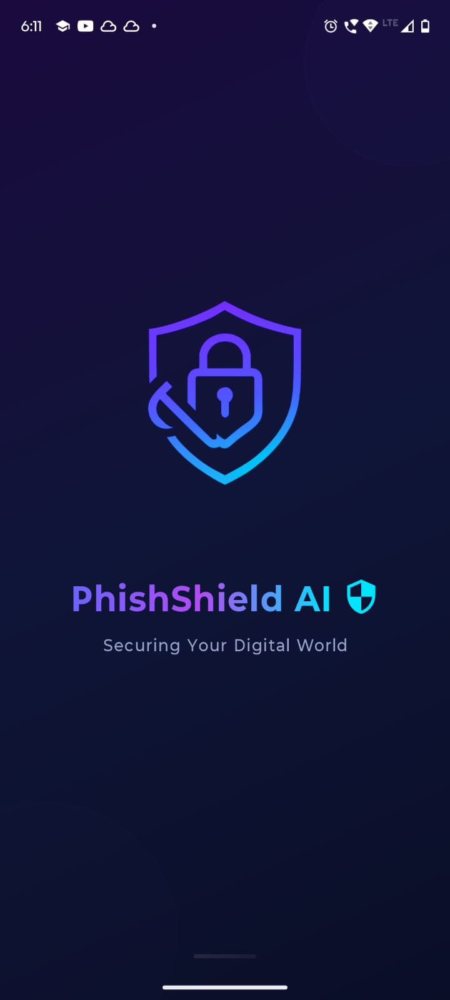
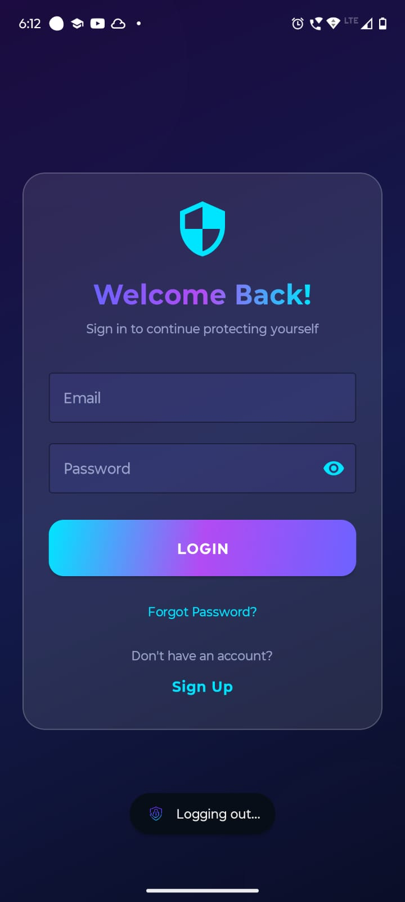
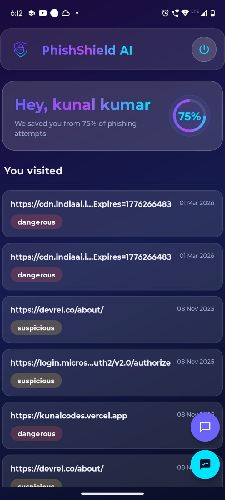
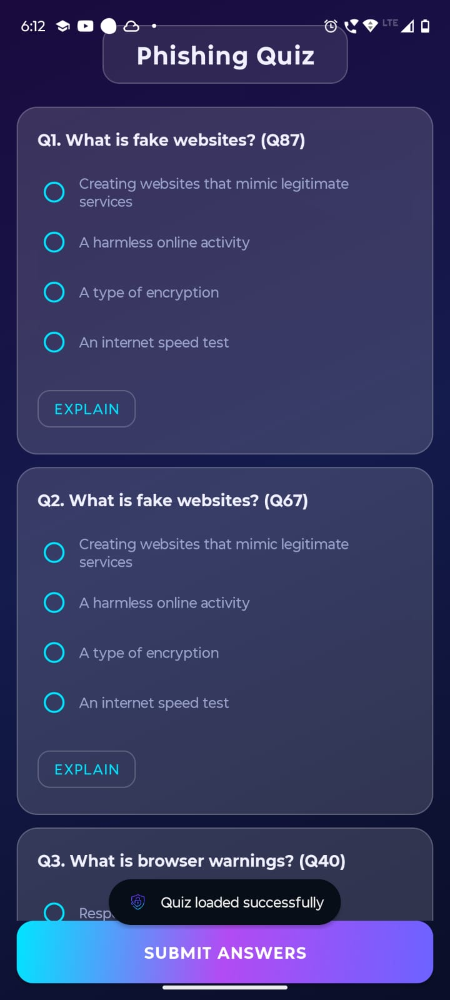
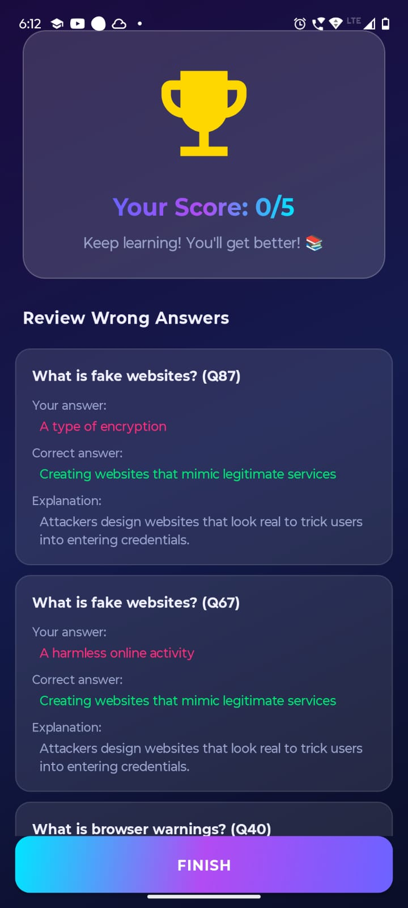
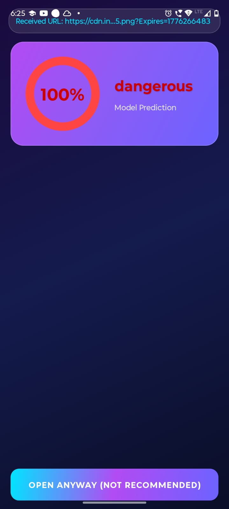

<div align="center">


# 🛡️ PhishShield AI

### *Securing Your Digital World*

[](https://android.com)
[](https://java.com)
[-6C63FF?style=for-the-badge)](https://developer.android.com)
[](https://developer.android.com)
[](https://github.com)
[](LICENSE)

**PhishShield AI** is an intelligent Android application that protects users from phishing attacks in real time. It intercepts URLs shared across apps, uses an AI-powered backend to predict phishing threats, and educates users through interactive quizzes — all wrapped in a stunning glassmorphic dark UI.

</div>

---

## 📸 Screenshots

<div align="center">

| Splash Screen | Login Screen | Dashboard |
|:---:|:---:|:---:|
|  |  |  |
| *App launch with animated shield logo and gradient branding* | *Glassmorphic login card with gradient button* | *Live threat history with risk badges & progress ring* |

| Phishing Quiz | Quiz Results | Link Detection |
|:---:|:---:|:---:|
|  |  |  |
| *AI-generated quiz questions with explain feature* | *Score card with wrong answer review & explanations* | *100% dangerous verdict with circular risk indicator* |

</div>

---

## ✨ Features

### 🔍 Real-Time Phishing Detection
- Intercepts **any URL shared from any app** on the device (browser, messages, email, etc.)
- Sends the URL to an **AI-powered REST API** for phishing analysis
- Displays a **risk percentage circular indicator** and a plain-English verdict (Safe / Suspicious / Dangerous)
- Opens the site in an embedded **WebView** after analysis

### 📊 Personal Threat Dashboard
- Shows a **history of all scanned URLs** with dates and risk status
- Displays a **live protection score** (percentage of threats blocked out of total scans)
- Personalized greeting with the logged-in user's name
- Color-coded status badges: 🟢 Safe · 🟡 Suspicious · 🔴 Dangerous

### 🧠 AI Phishing Quiz
- Fetches **AI-generated quiz questions** about phishing awareness from the backend
- Multiple-choice format with 4 options per question
- **"Explain" button** on every question to reveal detailed explanations before answering
- Submit all answers at once for a final scored result

### 📋 Quiz Result & Review
- Shows **score out of total** with a contextual motivational message
- Trophy icon with score in vibrant gradient text
- Full **review of every wrong answer**: your answer, correct answer, and explanation — perfect for learning

### 🔐 Authentication
- Secure **email + password login** with input validation
- JWT **token-based session** stored in SharedPreferences
- Dedicated **Sign Up** screen with name, email, phone, and password fields
- Persistent login — users stay logged in across sessions until they log out

### 🎨 Glassmorphic UI
- **Dark gradient backgrounds** (deep navy → indigo purple)
- **Frosted glass cards** with semi-transparent backgrounds and subtle white border strokes
- **3-color gradient text** (Purple → Magenta → Cyan) for headings
- **Gradient action buttons** with smooth corner radii
- Decorative **glowing ambient orbs** for depth
- Smooth **slide-up and fade-scale animations** throughout

---

## 🏗️ Tech Stack

| Category | Technology |
|---|---|
| **Language** | Java |
| **Platform** | Android (API 29–36) |
| **UI Framework** | Material Design 3 (MDC-Android) |
| **Networking** | Volley 1.2.1 |
| **Authentication** | JWT Token via SharedPreferences |
| **Build System** | Gradle (Kotlin DSL) |
| **Min SDK** | 29 (Android 10) |
| **Target SDK** | 36 (Android 16) |

---

## 📁 Project Structure

```
PhishShieldAI-App/
├── app/
│   └── src/main/
│       ├── java/com/backdoorz/phishshieldai/
│       │   ├── SplashActivity.java          # Launch screen with animations
│       │   ├── LoginActivity.java           # User authentication
│       │   ├── SignupActivity.java           # New user registration
│       │   ├── MainActivity.java            # Dashboard & URL history
│       │   ├── LinkHandlerActivity.java     # URL interception & AI prediction
│       │   ├── QuizActivity.java            # Phishing awareness quiz
│       │   ├── ResultActivity.java          # Quiz score & review
│       │   ├── QuizAdapter.java             # RecyclerView adapter for quiz
│       │   ├── WrongAnswerAdapter.java      # RecyclerView adapter for review
│       │   ├── VisitedUrlAdapter.java       # RecyclerView adapter for history
│       │   ├── QuizQuestion.java            # Data model
│       │   ├── VisitedUrl.java              # Data model
│       │   ├── PrefsManager.java            # SharedPreferences helper
│       │   └── Constants.java              # API endpoint constants
│       ├── res/
│       │   ├── layout/
│       │   │   ├── activity_splash.xml
│       │   │   ├── activity_login.xml
│       │   │   ├── activity_signup.xml
│       │   │   ├── activity_main.xml
│       │   │   ├── activity_link_handler.xml
│       │   │   ├── activity_quiz.xml
│       │   │   ├── activity_result.xml
│       │   │   ├── item_visited_url.xml
│       │   │   ├── item_quiz_question.xml
│       │   │   └── item_wrong_answer.xml
│       │   ├── drawable/                    # Gradients, glass backgrounds, icons
│       │   ├── values/
│       │   │   ├── colors.xml              # Full glassmorphic color palette
│       │   │   ├── themes.xml              # App theme with glass styles
│       │   │   ├── strings.xml
│       │   │   └── status_colors.xml
│       │   └── anim/                        # Slide-up & fade-scale animations
│       └── AndroidManifest.xml
├── screenshots/
│   ├── 1.jpeg   # Splash Screen
│   ├── 2.jpeg   # Login Screen
│   ├── 3.jpeg   # Dashboard
│   ├── 4.jpeg   # Phishing Quiz
│   ├── 5.jpeg   # Quiz Results
│   └── 6.jpeg   # Link Detection (Phishing Verdict)
└── README.md
```

---

## 🚀 Getting Started

### Prerequisites
- **Android Studio** Ladybug (2024.2) or newer
- **JDK 11** or higher
- Android device or emulator running **Android 10 (API 29)** or higher
- A running instance of the **PhishShield AI backend** (see backend setup)

### Installation

1. **Clone the repository**
   ```bash
   git clone https://github.com/developerkunalonline/PhishShieldAI-App.git
   cd PhishShieldAI-App
   ```

2. **Open in Android Studio**
   - Launch Android Studio
   - Select **File → Open** and navigate to the cloned directory
   - Wait for Gradle to sync

3. **Configure the API endpoint**
   - Open `app/src/main/java/com/backdoorz/phishshieldai/Constants.java`
   - Update the base URL to point to your running backend:
   ```java
   public static final String BASE_URL = "https://your-backend-url.com/";
   ```

4. **Build and Run**
   - Select your target device or emulator
   - Click **Run ▶** or press `Shift + F10`

---

## 🔌 API Endpoints

The app communicates with the PhishShield AI backend via the following endpoints:

| Endpoint | Method | Description |
|---|---|---|
| `/auth/login` | `POST` | Authenticate user, returns JWT token |
| `/auth/register` | `POST` | Register a new user |
| `/dashboard` | `GET` | Fetch user's URL scan history & stats |
| `/predict` | `POST` | Submit a URL for phishing prediction |
| `/quiz` | `GET` | Fetch AI-generated quiz questions |

> All authenticated endpoints require an `Authorization: Bearer <token>` header.

---

## 🎨 Design System

### Color Palette

| Role | Color | Hex |
|---|---|---|
| Background Start | Deep Navy | `#0A0E27` |
| Background End | Dark Indigo | `#1A0A3E` |
| Primary | Electric Purple | `#6C63FF` |
| Secondary | Deep Purple | `#141B4D` |
| Accent Cyan | Electric Cyan | `#00E5FF` |
| Accent Magenta | Hot Pink | `#FF2D7B` |
| Gradient Start | Purple | `#6C63FF` |
| Gradient Mid | Magenta | `#B24BF3` |
| Gradient End | Cyan | `#00E5FF` |
| Status Safe | Vibrant Green | `#00E676` |
| Status Suspicious | Amber | `#FFD740` |
| Status Dangerous | Red | `#FF5252` |

### Glassmorphism Implementation

The UI achieves a glassmorphic look using:
- **`MaterialCardView`** with `cardBackgroundColor` set to semi-transparent white (`#1AFFFFFF` to `#26FFFFFF`)
- **`strokeColor`** set to `#33FFFFFF` for subtle glass borders
- Layered **decorative orbs** behind cards for depth illusion
- **Gradient backgrounds** as the base layer for all screens

---

## 📋 Permissions

```xml
<uses-permission android:name="android.permission.INTERNET" />
<uses-permission android:name="android.permission.ACCESS_NETWORK_STATE" />
```

- **INTERNET** — Required for all API communication
- **ACCESS_NETWORK_STATE** — Used to check connectivity before making network requests

---

## 🔒 Security

- User credentials are **never stored locally** — only the JWT token is kept in SharedPreferences
- All network requests use **HTTPS** in production
- The LinkHandlerActivity uses `ACTION_VIEW` intent interception ensuring **no URLs are auto-loaded** without prediction results first
- Token is included in request headers using secure `Authorization: Bearer` pattern

---

## 🛣️ Roadmap

- [ ] **Blur effect** for true glassmorphism (via RenderScript or Blur library)
- [ ] **Push notifications** for threat alerts
- [ ] **AI Chatbot** for phishing Q&A (chat FAB already present in UI)
- [ ] **Biometric authentication** support
- [ ] **Offline mode** with cached prediction history
- [ ] **Dark/Light theme toggle**
- [ ] **URL bookmarking** to save safe links
- [ ] **Widget** for quick URL scanning from the home screen

---

## 🤝 Contributing

Contributions are welcome! Please follow these steps:

1. Fork the repository
2. Create your feature branch: `git checkout -b feature/AmazingFeature`
3. Commit your changes: `git commit -m 'Add some AmazingFeature'`
4. Push to the branch: `git push origin feature/AmazingFeature`
5. Open a Pull Request

---

## 👨‍💻 Author

**Kunal Kumar**
- GitHub: [@developerkunalonline](https://github.com/developerkunalonline)

---

## 📄 License

This project is licensed under the **MIT License** — see the [LICENSE](LICENSE) file for details.

---

<div align="center">

Made with ❤️ and 🛡️ by **Kunal Kumar**

*Stay safe. Stay vigilant. PhishShield has your back.*

</div>
